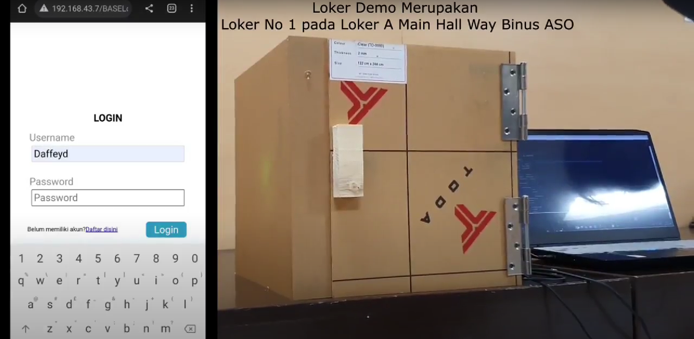
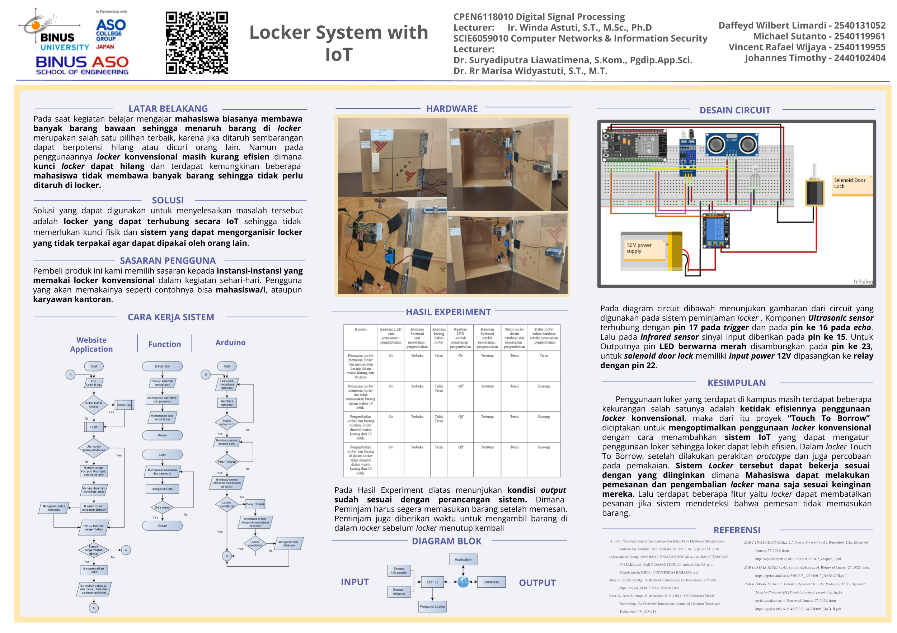

# Smart Locker System with IoT for University
This project create a efficient locker system that allocate unused locker to them who want to use it

---

### Table of Contents

- [Description](#description)
- [Documentation](#documentation)
- [Author Info](#author-info)

---

## Description

This project is using the ESP32, this project outcome is to make locker that can be accessed by student using their smartphones, they also can access a real time status data of locker

#### Technologies

- MySQL Databases
- API

[Back To The Top](#Smart-Locker-System-with-IoT-for-University)

---

## Documentation

[Demo Video](https://drive.google.com/file/d/1sCWAGYDlpMfWy5I_IYry1SwoarwXdxoT/view?usp=share_link)

[Back To The Top](#Smart-Locker-System-with-IoT-for-University)

---
## Author Info

- Instagram - [daffeydwilbert](https://www.instagram.com/daffeydwilbert/)
- Email - daffeydwilbert@gmail.com

[Back To The Top](#Smart-Locker-System-with-IoT-for-University)
